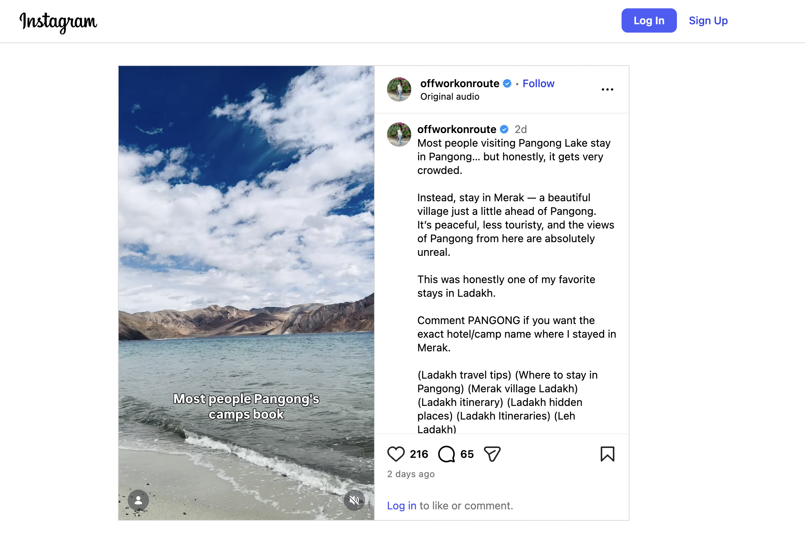
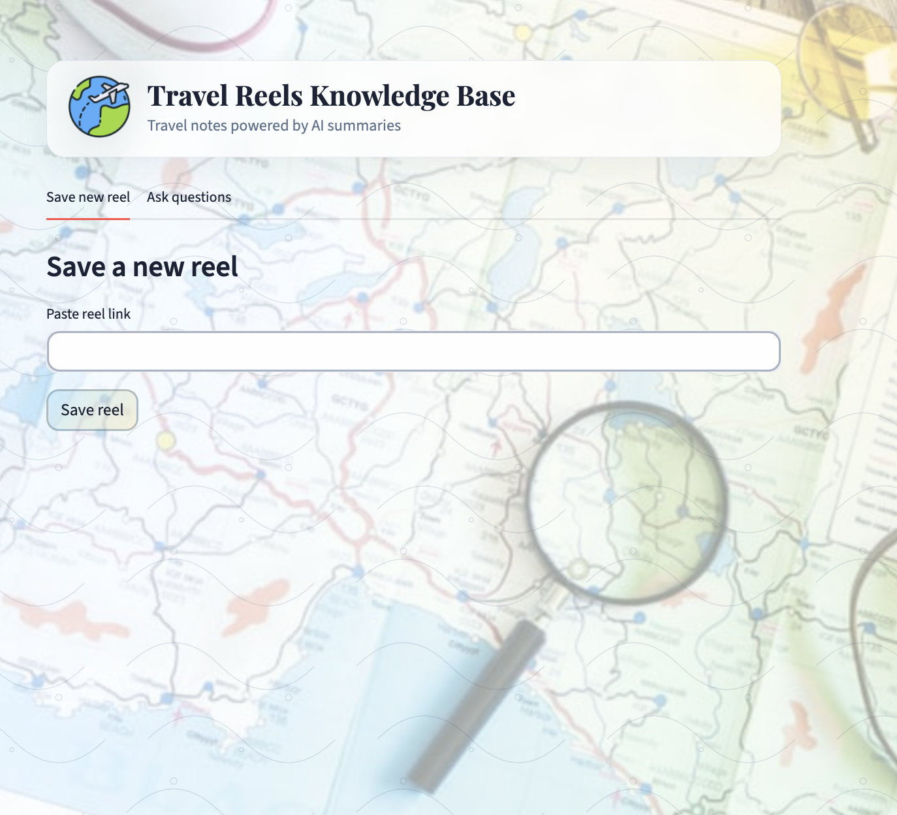
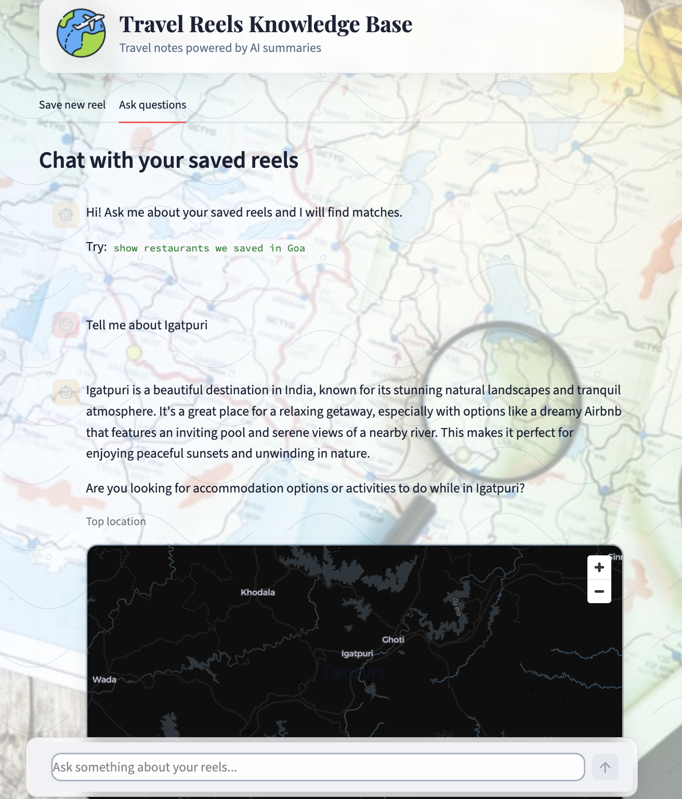

## Travel Reels Knowledge Base 🎥🧠

A small AI project that turns **Travel reels into a searchable knowledge base**.

## The Problem 🤔

My wife and I constantly share reels for:

- 🌍 travel destinations  
- 🍜 restaurants  
- 🏝 hidden beaches  
- 🍣 food spots  

They get buried across multiple WhatsApp groups, and after a while we forget things like:

> “What was that Goa restaurant reel?”  
> “Didn't we save a Bali beach video?”

Scrolling through chat history becomes impossible.

---

## The Idea 💡

Turn reels into a **personal AI memory**.

Paste a reel URL and the system will:

1. Download the reel  
2. Extract frames from the video  
3. Analyze the frames with an AI vision model  
4. Generate a summary + tags  
5. Store embeddings in a vector database  

Later you can **search it using natural language**.

Example queries:

- show restaurants we saved in Goa  
- any reels about Bali beaches?  
- cheap street food ideas  

---

## Demo 🚀

### Copy a Reel URL



### Paste the Reel URL and get AI Generated Summary



### Search the Knowledge Base



---

## Tech Stack ⚙️

**Backend**
- FastAPI

**AI**
- OpenAI (vision summarization + embeddings)

**Vector Database**
- Pinecone

**Frontend**
- Streamlit

**Video Processing**
- yt-dlp (reel download)  
- ffmpeg (frame extraction)

---

## Architecture 🏗

Reel URL  
↓  
Download reel (yt-dlp)  
↓  
Extract frames (ffmpeg)  
↓  
Vision model summary  
↓  
Embeddings  
↓  
Pinecone vector database  
↓  
Natural language search  

---

## Setup 🛠

Create a virtual environment:

```bash
cd "Whatsapp Reel Knowledge Base"

python -m venv .venv
source .venv/bin/activate   # Windows: .venv\Scripts\activate
pip install -r requirements.txt
```

Create `.env` file:

```bash
OPENAI_API_KEY=sk-...
PINECONE_API_KEY=...
REDIS_URL=redis://localhost:6379/0
CELERY_BROKER_URL=redis://localhost:6379/0
CELERY_RESULT_BACKEND=redis://localhost:6379/0
```

⚠️ Make sure `.env` is not committed to source control.

---

## Run Backend

```bash
uvicorn backend.main:app --reload --port 8000
```

API docs:

`http://localhost:8000/docs`

---

## Run Backend + Celery (for async ingestion)

`POST /reels` now enqueues ingestion work in Celery.  
FastAPI, Celery worker, and Redis run as separate processes.

Start Redis (if not already running):

```bash
redis-server
```

Start API:

```bash
uvicorn backend.main:app --reload --port 8000
```

Start Celery worker (new terminal):

```bash
celery -A backend.celery_app:celery_app worker --loglevel=info
```

Start Celery beat only if you need scheduled jobs (optional):

```bash
celery -A backend.celery_app:celery_app beat --loglevel=info
```

Combined dev command (API + worker in one terminal):

```bash
uvicorn backend.main:app --reload --port 8000 & celery -A backend.celery_app:celery_app worker --loglevel=info
```

---

## Run UI

```bash
streamlit run ui/app.py
```

Open in browser:

`http://localhost:8501`

---

## Backfill Missing Map Coordinates

If older Pinecone records do not have coordinates, they may not show up on the map.
Run this migration to backfill missing `enrichment_lat` / `enrichment_lng` (and legacy `lat` / `lon` when present).

Prerequisites:

- `PINECONE_API_KEY` set in `.env`
- `LOCATIONIQ_API_KEY` set in `.env` (used for geocoding by place/city/country)
- Optional but recommended: `TAVILY_API_KEY` set in `.env` to recover missing place context from weak/empty metadata

Dry run first:

```bash
python scripts/migrate_backfill_coords.py --dry-run
```

Run migration:

```bash
python scripts/migrate_backfill_coords.py
```

When place fields are missing, the script now:

1. Tries to recover context from stored reel metadata (`enrichment_json`, `doc_text`, summary)  
2. For `instagram.com` / `instagr.am` reel URLs, fetches public metadata with **yt-dlp** (same as the backend: title, description, hashtags, location tag) and geocodes those hints (state-level or city-level is fine)  
3. Falls back to Tavily search (if `TAVILY_API_KEY` is set)  
4. Geocodes recovered candidates via LocationIQ  

Useful options:

```bash
# Process only first 50 records safely
python scripts/migrate_backfill_coords.py --max-records 50

# Use a specific namespace
python scripts/migrate_backfill_coords.py --namespace my-namespace

# Skip Instagram metadata fetch (no yt-dlp / IG requests)
python scripts/migrate_backfill_coords.py --no-ig-fetch

# Slower delay between IG metadata calls (rate limits)
python scripts/migrate_backfill_coords.py --ig-sleep-seconds 2
```

---

## Usage 🧭

### Save a Reel

Paste a reel URL and optionally add tags like:

- goa  
- restaurant  
- street food  

The backend will:

- download the reel  
- extract frames  
- generate an AI summary  
- create embeddings  
- store everything in Pinecone  

### Ask Questions

Example queries:

- show restaurants we saved in Goa  
- any reels about Bali?  
- cheap street food ideas  

The system embeds the query, searches Pinecone, and returns the most relevant reels.

